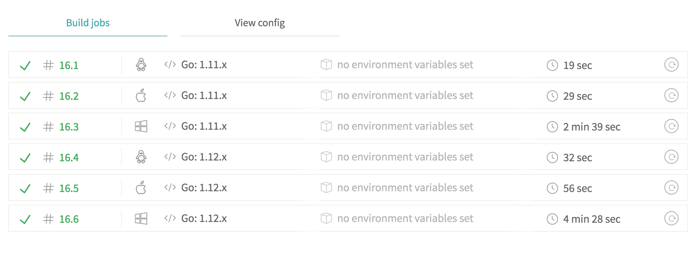
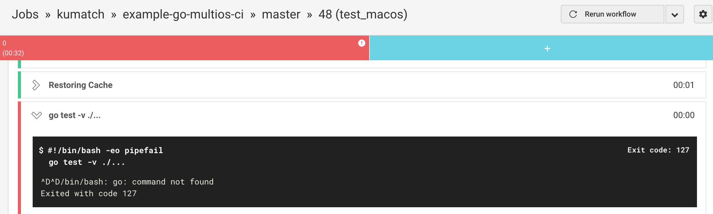
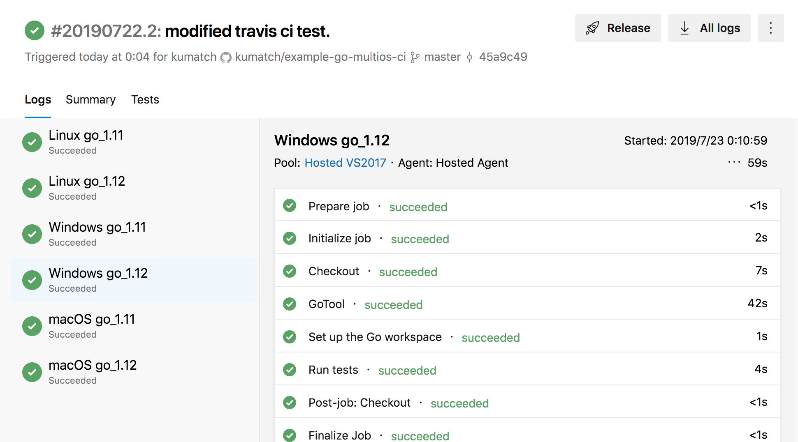

# [fit] Goマルチプラットフォームのための CIサービス

2019-07-26 Umeda.go 2019 Summer

Yosuke Kumakura

---

## About

* kuamtch / 熊倉洋介
* freee 株式会社
* go / ruby / javascript / node.js / php

---

> 「マルチプラットフォームに展開されるソフトを Go で開発する」
> ビルド環境 (CI) を考える

---

## 基本の話

* ビルド時にOS/アーキテクチャ固有な Go コードを扱う仕組みがある
  * コード先頭のビルドタグ (`// +build GOOS`)
  * ファイル名 (`_GOOS`, `_GOARCH`)
* 詳しくは [https://golang.org/pkg/go/build/](https://golang.org/pkg/go/build/)

---

## 目標

* Windows / OSX / Linux の CI を回したい
  * クロスコンパイルが目的ではない
  * OS 固有（依存）な処理に対してテストできるようにしたい
* 楽したい（自分で環境作らない）

---

## 確認用コード

* [https://github.com/kumatch/example-go-multios-ci](https://github.com/kumatch/example-go-multios-ci)
* Windows/OSX/Linux 毎に異なる処理コードを用意
  * テストコードも一応 OS 毎に用意してみた
* これをいろんな CI サービスで動かす
  * 今回はテスト実行のみ

---

## Travis CI

* Windows / OSX / Linux OK
  * Windows はまだ若干不安定かも

---

## CircleCI

* Windows 未サポート
* macOS プランで Mac 環境が使えるけど Go が入ってない

---

## AppVeyor

* Windows / Linux
* これまでは Windows 向けに＋コレで使われていた印象
* 異なる環境向けにフローの定義を書くのが大変（怪しい）
  * matrix only とかやって上書きする

---

## AWS CodeBuild / GCP Cloud Build

* Docker によるビルド環境
  * Windows / Linux
* 自分に必要なものを１つずつ作りましょうみたいなイメージ
  * 手間はかかるが好き勝手はできそう

---

## Azure DevOps (Pipelines)

* Windows / OSX / Linux
* 「CIサービス」のシンプルさとマネージドのいいとこ取り

---

## まとめ

* Travis CI は簡単にマルチプラットフォーム向けの対応が可能
* Azure Pipelines もめっちゃ良い
* Windows向けのみに限定しての AppVeyor は引き続きアリ
* AWS や GCP はガチ系
